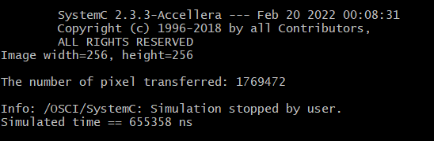

Written by Freud L. Lewis Piercius, student ID: 110061422

The GitHub repo link for HW1 is as follow: git@github.com:freud96/EE6470_HW1.git.

Introduction
    In Digital Signal Processing, Blurring is often used to make an object less clear or more different, as to facilitate performing analysis in in the hope to gather enough datas to identify objects. Gaussian Blur is a filter that uses a Gaussian Kernel. The main objective of the homework was to implement a Gaussian blur filter with SystemC modules connected with SystemC FIFO channels. The homework was devided into two parts; below are the descriptions of both parts 1 and 2, alongside the algorithm used to implement them.

    The input image was given as 
    

Part 1: Gaussian Blur with FIFO channels
    In this part, a code base from lab 2 was provided with all channel connected already connected. Originally, we have two modules, one, the testbench which will load the image, take in the image datas to then send them to the Gaussian filter module where the Gaussian kernel is stored.
    
    How is it implemented? 
    
    The system is synchronous, there is transfer of 3 color pixels from the testbench to the Gaussian filter module which will multiply each entry pixel by its corresponding kernel value. The number of pixel transfer sent/receive between the two modules is 589824. We have such huge amount because of the a single a to find the convolution of a centered pixel, the module also sends its other 8 neighborhood. so we can find the value as: 3*256*256*9. the simulation time is 655358 ns. 
    

    the output image:
    ...

Part 2: Data movement with row buffers
    Because in part one the number of transfer made from the testbench module to the other module is high, we were asked to implement the modules such that the tranfer is based on row of pixels instead of every single pixel. To do that we modify the fifo variable to use array then map each port to its corresponding, the reason why we use array instead of just a simple 8-bit variable is to make it easier for the program to wait on the data output to be written.  

    In the Gaussian Filter module there will be three row buffers to store the incoming data so that they can be re-used. at first the buffers have the value zero. the program will start computing output pixels after second iteration in module testbench. the row buffers' size is 3*258 because we want the targeted pixel to be in the middle. After each iteration,the incoming datas will be stored in the last row, the ones that were stored will be shifted up, meaning that the top will be pushed out; the row buffers serve as FIFOs. The output is almost same, and as compared to part 1's result, this not only take less time as we don't need to wait on all 8 neighborhood pixels for the output pixels to be computed. The number of pixel transferred through FIFO channels is way less than found in part 1. 

Note: For result of pixel transfer of both part, only from testbench to Gaussian filter pixel transfer was calculated; meaning that the output's transfer effort isn't included.    

As using raw eyes, the two output looks exactly same. The difference lies in the number of data transferred through FIFO channels connection. 
